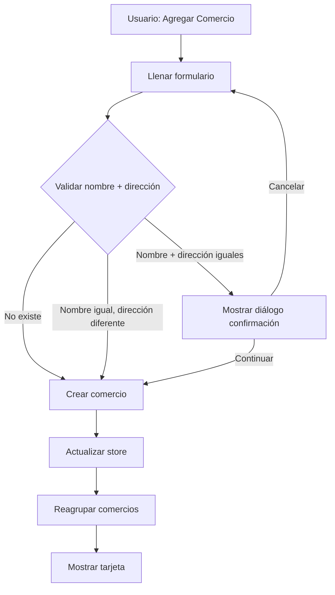
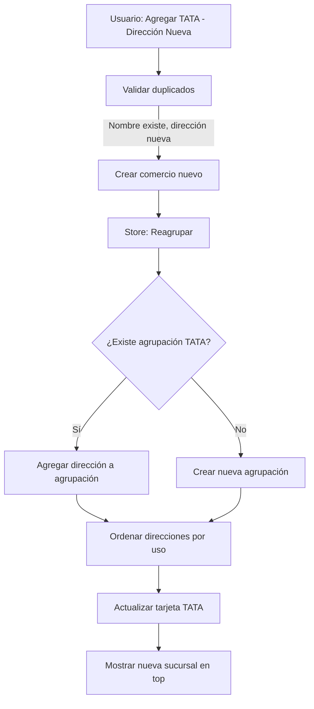
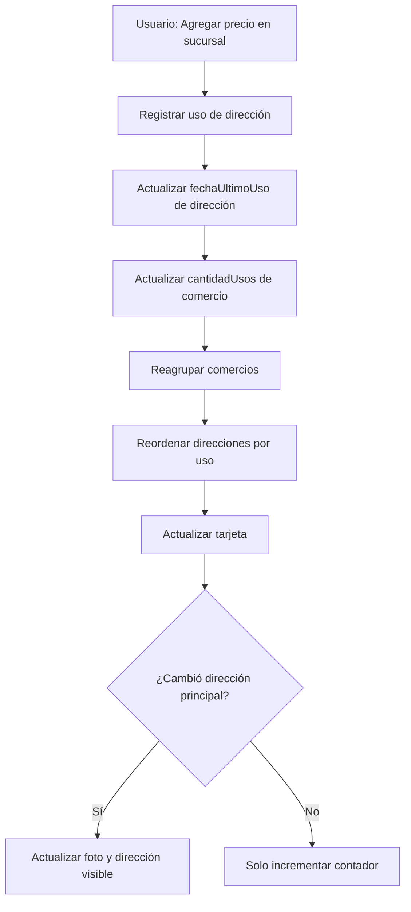

# 📋 Plan: Sistema de Gestión de Comercios y Sucursales

**Fecha:** 2026-02-16 (Actualizado: 2026-02-17)
**Estado:** 🔄 En progreso (Fases 1-6 completadas, Fases 7-9 en desarrollo)
**Prioridad:** Alta

---

## 🎯 Objetivo General

Mejorar el sistema de gestión de comercios para soportar cadenas de comercios con múltiples sucursales, optimizando la visualización, validación y agrupación inteligente de comercios con el mismo nombre pero diferentes ubicaciones.

---

## 📝 Resumen Ejecutivo

### Problemas Actuales
1. El campo "tipo de comercio" es obligatorio pero debería ser opcional
2. No se detectan cadenas de comercios (mismo nombre, diferentes direcciones)
3. Las tarjetas de comercios no agrupan sucursales de una misma cadena
4. La dirección principal no se muestra en la tarjeta de comercio
5. No hay indicación visual de cuál sucursal se usó más recientemente
6. El contador de usos no distingue entre sucursal específica y cadena completa

### Solución Propuesta
Sistema inteligente que:
- Valida duplicados considerando nombre + dirección
- Agrupa comercios de cadenas en una sola tarjeta
- Muestra la sucursal más reciente automáticamente
- Diferencia entre comercios distintos en la misma ubicación (shopping centers)
- Presenta información clara y actualizada dinámicamente

---

## 🔍 Análisis de Casos de Uso

### Caso 1: Cadena de Supermercados
**Escenario:** Usuario agrega TATA en 3 ubicaciones diferentes

```
Entrada:
- TATA - Av. Italia 1234
- TATA - Av. Brasil 5678
- TATA - 18 de Julio 999

Resultado esperado:
✅ 3 sucursales creadas
✅ 1 sola tarjeta "TATA"
✅ Muestra última sucursal usada
✅ Lista desplegable con 3 direcciones
```

### Caso 2: Shopping Center
**Escenario:** Usuario agrega comercios en mismo shopping

```
Entrada:
- McDonald's - Av. Italia 1234
- Burger King - Av. Italia 1234
- Farmacia AAA - Av. Italia 1234

Resultado esperado:
✅ 3 comercios independientes
✅ 3 tarjetas separadas
✅ Sin agrupación (nombres diferentes)
```

### Caso 3: Duplicado Exacto
**Escenario:** Usuario intenta agregar comercio existente

```
Entrada:
- TATA - Av. Italia 1234 (ya existe)

Resultado esperado:
⚠️ Diálogo de confirmación
📌 "Ya existe este comercio con esta dirección"
✅ Opción de continuar o cancelar
```

---

## 🧩 Componentes Afectados y Reutilización

### 📂 Archivos a Modificar

#### 1. **FormularioComercio.vue**
**Ubicación:** `src/components/Formularios/FormularioComercio.vue`

**Cambios necesarios:**
- Remover validación obligatoria (`required`) del campo `tipo`
- Mantener el campo visible pero opcional
- Actualizar placeholder para indicar que es opcional

**Reutilización:** ✅ El formulario ya existe, solo ajustar validaciones

---

#### 2. **ComerciosService.js**
**Ubicación:** `src/almacenamiento/servicios/ComerciosService.js`

**Estado actual:**
- ✅ Ya tiene `validarDuplicados()` con 3 niveles
- ✅ Ya tiene `normalizar()` para comparar textos
- ✅ Ya tiene `similitudTexto()` para detectar similares

**Cambios necesarios:**
- ✅ REUTILIZAR función `validarDuplicados()` existente
- ✅ REUTILIZAR función `normalizar()` existente
- ⚠️ Ajustar lógica de validación NIVEL 1 (duplicado exacto):
  - Actualmente: Rechaza si nombre + dirección coinciden
  - Nuevo: Mostrar diálogo de confirmación (permitir continuar)

**Código a modificar:**
```javascript
// ANTES (líneas 178-196):
if (duplicadoExacto) {
  return {
    esDuplicado: true,
    nivel: 1,
    tipo: 'exacto',
    comercio: duplicadoExacto,
    mensaje: 'Ya existe un comercio con el mismo nombre y dirección',
  }
}

// DESPUÉS:
if (duplicadoExacto) {
  return {
    esDuplicado: true,
    nivel: 1,
    tipo: 'exacto',
    comercio: duplicadoExacto,
    mensaje: 'Ya existe este comercio en esta ubicación',
    permitirContinuar: true,  // ⭐ NUEVO: Permitir confirmar
  }
}
```

**Nueva funcionalidad a agregar:**
```javascript
/**
 * Agrupa comercios por nombre (detecta cadenas)
 * @param {Array} comercios - Lista de comercios
 * @returns {Array} Comercios agrupados
 */
function agruparPorCadena(comercios) {
  const agrupados = new Map()

  comercios.forEach(comercio => {
    const nombreNormalizado = normalizar(comercio.nombre)

    if (!agrupados.has(nombreNormalizado)) {
      agrupados.set(nombreNormalizado, {
        ...comercio,
        esCadena: false,
        sucursales: [comercio]
      })
    } else {
      // Es una cadena (mismo nombre)
      const grupo = agrupados.get(nombreNormalizado)
      grupo.esCadena = true
      grupo.sucursales.push(comercio)
    }
  })

  return Array.from(agrupados.values())
}
```

**Reutilización:** ✅ 90% del código ya existe, solo ajustes menores

---

#### 3. **comerciosStore.js**
**Ubicación:** `src/almacenamiento/stores/comerciosStore.js`

**Estado actual:**
- ✅ Ya tiene getter `comerciosPorUso` (ordena por uso reciente)
- ✅ Ya tiene actions para agregar/editar/eliminar

**Nuevos getters a agregar:**
```javascript
getters: {
  // ... getters existentes ...

  /**
   * Agrupa comercios en cadenas (mismo nombre)
   * Ordena direcciones por uso reciente (top 3)
   */
  comerciosAgrupados: (state) => {
    const agrupados = new Map()

    state.comercios.forEach(comercio => {
      const nombreNormalizado = ComerciosService.normalizar(comercio.nombre)

      if (!agrupados.has(nombreNormalizado)) {
        agrupados.set(nombreNormalizado, {
          id: comercio.id,
          nombre: comercio.nombre,
          tipo: comercio.tipo,
          foto: null,
          esCadena: false,
          totalSucursales: 1,
          direcciones: [...comercio.direcciones],
          fechaUltimoUso: comercio.fechaUltimoUso,
          cantidadUsos: comercio.cantidadUsos,
          comerciosOriginales: [comercio] // Para referencia
        })
      } else {
        // Agregar sucursal a la cadena
        const grupo = agrupados.get(nombreNormalizado)
        grupo.esCadena = true
        grupo.totalSucursales++
        grupo.direcciones.push(...comercio.direcciones)
        grupo.comerciosOriginales.push(comercio)

        // Actualizar fecha si es más reciente
        if (new Date(comercio.fechaUltimoUso) > new Date(grupo.fechaUltimoUso)) {
          grupo.fechaUltimoUso = comercio.fechaUltimoUso
        }

        // Sumar usos totales
        grupo.cantidadUsos += comercio.cantidadUsos
      }
    })

    // Procesar cada grupo
    const resultado = Array.from(agrupados.values()).map(grupo => {
      // Ordenar direcciones por uso reciente
      grupo.direcciones.sort((a, b) => {
        const fechaA = new Date(a.fechaUltimoUso || 0)
        const fechaB = new Date(b.fechaUltimoUso || 0)
        return fechaB - fechaA
      })

      // Top 3 direcciones más recientes
      grupo.direccionesTop3 = grupo.direcciones.slice(0, 3)

      // Dirección principal (más reciente)
      grupo.direccionPrincipal = grupo.direcciones[0]

      // Foto de la sucursal más reciente
      const comercioMasReciente = grupo.comerciosOriginales
        .sort((a, b) => new Date(b.fechaUltimoUso) - new Date(a.fechaUltimoUso))[0]
      grupo.foto = comercioMasReciente.foto

      return grupo
    })

    // Ordenar por uso reciente
    return resultado.sort((a, b) => {
      const fechaA = new Date(a.fechaUltimoUso)
      const fechaB = new Date(b.fechaUltimoUso)
      return fechaB - fechaA
    })
  }
}
```

**Reutilización:** ✅ Store existente, solo agregar getter nuevo

---

#### 4. **TarjetaComercioYugioh.vue**
**Ubicación:** `src/components/Tarjetas/TarjetaComercioYugioh.vue`

**Estado actual:**
- ✅ Ya muestra contador de direcciones (línea 27-28)
- ✅ Ya tiene lista expandible de direcciones (líneas 44-60)
- ✅ Ya formatea último uso (líneas 103-118)

**Cambios necesarios:**

1. **Actualizar contador de direcciones:**
```vue
<!-- ANTES (línea 27-28): -->
<span>
  {{ comercio.direcciones.length }}
  {{ comercio.direcciones.length === 1 ? 'dirección' : 'direcciones' }}
</span>

<!-- DESPUÉS: -->
<span>
  {{ comercio.totalSucursales || comercio.direcciones.length }}
  {{ (comercio.totalSucursales || comercio.direcciones.length) === 1 ? 'sucursal' : 'sucursales' }}
</span>
```

2. **Cambiar título del expandible:**
```vue
<!-- ANTES (línea 40): -->
<span>DIRECCIONES</span>

<!-- DESPUÉS: -->
<span>{{ comercio.esCadena ? 'SUCURSALES' : 'DIRECCIONES' }}</span>
```

3. **Mostrar contador de usos por sucursal:**
```vue
<!-- ANTES (línea 31-34): -->
<div v-if="comercio.cantidadUsos > 0" class="info-item">
  <IconShoppingCart :size="16" class="text-grey-6" />
  <span>{{ comercio.cantidadUsos }} usos</span>
</div>

<!-- DESPUÉS: -->
<div v-if="comercio.cantidadUsos > 0" class="info-item">
  <IconShoppingCart :size="16" class="text-grey-6" />
  <span>
    {{ obtenerUsosActuales() }} usos
    <span v-if="comercio.esCadena" class="text-grey-5">
      ({{ comercio.cantidadUsos }} total)
    </span>
  </span>
</div>
```

4. **Agregar dirección principal debajo de la imagen:**
```vue
<!-- NUEVO: Agregar en template slot #info-inferior -->
<template #info-inferior>
  <!-- Dirección principal -->
  <div v-if="comercio.direccionPrincipal" class="direccion-principal">
    <IconMapPin :size="14" class="text-grey-6" />
    <span class="texto-direccion">
      {{ comercio.direccionPrincipal.calle }}
      <span v-if="comercio.direccionPrincipal.barrio">
        , {{ comercio.direccionPrincipal.barrio }}
      </span>
    </span>
  </div>

  <!-- Info existente -->
  <div class="info-comercio">
    <!-- ... resto del código existente ... -->
  </div>
</template>
```

5. **Mostrar solo top 3 direcciones en expandible:**
```vue
<!-- ANTES (línea 44): -->
<div v-for="direccion in comercio.direcciones" :key="direccion.id">

<!-- DESPUÉS: -->
<div v-for="direccion in comercio.direccionesTop3 || comercio.direcciones" :key="direccion.id">

<!-- Agregar indicador de más direcciones -->
<div v-if="comercio.direcciones.length > 3" class="mas-direcciones">
  <IconAlertCircle :size="16" class="text-orange" />
  <span>Y {{ comercio.direcciones.length - 3 }} sucursales más...</span>
</div>
```

6. **Nuevo método para calcular usos de sucursal actual:**
```javascript
// Agregar en script setup
const obtenerUsosActuales = () => {
  if (!props.comercio.esCadena) {
    return props.comercio.cantidadUsos
  }

  // Si es cadena, obtener usos de la sucursal principal
  const direccionPrincipal = props.comercio.direccionPrincipal
  if (!direccionPrincipal) return props.comercio.cantidadUsos

  // Buscar comercio original de esta dirección
  const comercioOriginal = props.comercio.comerciosOriginales?.find(c =>
    c.direcciones.some(d => d.id === direccionPrincipal.id)
  )

  return comercioOriginal?.cantidadUsos || 0
}
```

**Estilos nuevos:**
```css
.direccion-principal {
  display: flex;
  align-items: flex-start;
  gap: 6px;
  padding: 8px 0;
  border-top: 1px solid var(--borde-suave);
  margin-top: 8px;
  padding-top: 8px;
  font-size: 13px;
  color: var(--texto-secundario);
}

.texto-direccion {
  flex: 1;
  line-height: 1.4;
}

.mas-direcciones {
  display: flex;
  align-items: center;
  gap: 8px;
  padding: 12px;
  background: var(--fondo-drawer);
  border-radius: 8px;
  margin-top: 8px;
  font-size: 12px;
  color: var(--texto-secundario);
  font-style: italic;
}
```

**Reutilización:** ✅ 80% del componente se reutiliza, solo ajustes visuales

---

#### 5. **DialogoAgregarComercio.vue**
**Ubicación:** `src/components/Formularios/Dialogos/DialogoAgregarComercio.vue`

**Estado actual:**
- ✅ Ya usa `validarDuplicados()` (línea 124)
- ✅ Ya tiene diálogos de coincidencias (líneas 32-38)

**Cambios necesarios:**

1. **Manejar nivel 1 (duplicado exacto) con confirmación:**
```javascript
// Modificar función validarDuplicados() (líneas 124-152)
async function validarDuplicados() {
  if (!formularioValido.value) return

  try {
    const resultado = await ComerciosService.validarDuplicados(datosComercio.value)

    if (resultado.esDuplicado) {
      nivelValidacion.value = resultado.nivel

      if (resultado.nivel === 1) {
        // ⭐ NUEVO: Duplicado exacto - mostrar confirmación
        dialogoDuplicadoExactoAbierto.value = true
        comercioDuplicadoExacto.value = resultado.comercio
      } else if (resultado.nivel === 2) {
        // Nombres similares
        comerciosSimilares.value = resultado.comercios
        dialogoCoincidenciasAbierto.value = true
      } else if (resultado.nivel === 3) {
        // Misma ubicación
        comerciosEnMismaUbicacion.value = resultado.comercios
        dialogoMismaUbicacionAbierto.value = true
      }

      return false
    }

    return true
  } catch (error) {
    console.error('❌ Error al validar duplicados:', error)
    return true
  }
}
```

2. **Agregar nuevo diálogo de duplicado exacto:**
```vue
<!-- Agregar en template -->
<DialogoDuplicadoExacto
  v-model="dialogoDuplicadoExactoAbierto"
  :comercio-existente="comercioDuplicadoExacto"
  :datos-nuevos="datosComercio"
  @continuar="forzarCrearDuplicado"
  @cancelar="dialogoDuplicadoExactoAbierto = false"
/>
```

**Reutilización:** ✅ Lógica de validación ya existe, solo agregar nuevo diálogo

---

#### 6. **NUEVO: DialogoDuplicadoExacto.vue**
**Ubicación:** `src/components/Formularios/Dialogos/DialogoDuplicadoExacto.vue`

**Propósito:** Mostrar confirmación cuando nombre + dirección son idénticos

**Props:**
- `modelValue` (Boolean): Controla visibilidad
- `comercioExistente` (Object): Comercio que ya existe
- `datosNuevos` (Object): Datos que el usuario intenta agregar

**Template:**
```vue
<template>
  <q-dialog v-model="dialogoAbierto">
    <q-card style="min-width: 350px">
      <q-card-section class="row items-center q-pb-none">
        <q-icon name="warning" color="orange" size="24px" />
        <span class="text-h6 q-ml-sm">Comercio Duplicado</span>
        <q-space />
        <q-btn icon="close" flat round dense @click="cerrar" />
      </q-card-section>

      <q-card-section>
        <p class="text-body2">
          Ya existe un comercio con este nombre y dirección:
        </p>

        <div class="comercio-existente q-mt-md">
          <div class="comercio-nombre">
            <q-icon name="store" color="primary" />
            <strong>{{ comercioExistente?.nombre }}</strong>
          </div>
          <div class="comercio-direccion q-mt-sm">
            <q-icon name="location_on" color="grey-6" size="18px" />
            <span>{{ comercioExistente?.direcciones[0]?.calle }}</span>
          </div>
          <div v-if="comercioExistente?.direcciones[0]?.barrio" class="text-grey-6 q-ml-md text-caption">
            {{ comercioExistente?.direcciones[0]?.barrio }}
          </div>
        </div>

        <q-separator class="q-my-md" />

        <p class="text-body2 text-grey-8">
          ¿Estás seguro que quieres crear un comercio duplicado?
        </p>
      </q-card-section>

      <q-card-actions align="right">
        <q-btn flat label="Cancelar" color="grey-7" @click="cancelar" />
        <q-btn
          unelevated
          label="Sí, crear duplicado"
          color="orange"
          @click="continuar"
        />
      </q-card-actions>
    </q-card>
  </q-dialog>
</template>
```

**Reutilización:** ❌ Componente nuevo (pero usa patrón de diálogos existentes)

---

#### 7. **ComerciosPage.vue**
**Ubicación:** `src/pages/ComerciosPage.vue`

**Estado actual:**
- ✅ Ya carga comercios con `comerciosStore.comerciosPorUso` (línea 149)
- ✅ Ya tiene búsqueda implementada

**Cambios necesarios:**

1. **Usar comercios agrupados en lugar de comercios normales:**
```javascript
// ANTES (líneas 147-162):
const comerciosFiltrados = computed(() => {
  if (!textoBusqueda.value) {
    return comerciosStore.comerciosPorUso
  }
  // ... filtrado ...
})

// DESPUÉS:
const comerciosFiltrados = computed(() => {
  const comercios = comerciosStore.comerciosAgrupados // ⭐ Usar getter nuevo

  if (!textoBusqueda.value) {
    return comercios
  }

  const textoNormalizado = textoBusqueda.value.toLowerCase()
  return comercios.filter((comercio) => {
    return (
      comercio.nombre.toLowerCase().includes(textoNormalizado) ||
      comercio.tipo.toLowerCase().includes(textoNormalizado) ||
      comercio.direcciones.some((dir) =>
        dir.nombreCompleto.toLowerCase().includes(textoNormalizado),
      )
    )
  })
})
```

2. **Actualizar contador de página:**
```vue
<!-- ANTES (línea 17): -->
<p class="contador-items">{{ comerciosStore.comercios.length }} comercios guardados</p>

<!-- DESPUÉS: -->
<p class="contador-items">
  {{ comerciosStore.comerciosAgrupados.length }} comercios
  <span v-if="comerciosStore.totalDirecciones > comerciosStore.comercios.length" class="text-grey-6">
    ({{ comerciosStore.totalDirecciones }} sucursales)
  </span>
</p>
```

**Reutilización:** ✅ Solo cambiar referencia al getter

---

## 🔄 Flujos de Usuario

### Flujo 1: Agregar Comercio Nuevo (Cadena Nueva)



### Flujo 2: Agregar Sucursal a Cadena Existente



### Flujo 3: Agregar Precio a Sucursal



---

## 📊 Estructura de Datos

### Comercio Individual (Storage)
```javascript
{
  id: "1708123456789abc",
  nombre: "TATA",
  tipo: "Supermercado", // Opcional
  direcciones: [
    {
      id: "dir_123",
      calle: "Av. Italia 1234",
      barrio: "Pocitos",
      ciudad: "Montevideo",
      nombreCompleto: "TATA - Av. Italia 1234",
      fechaUltimoUso: "2026-02-16T10:30:00Z"
    }
  ],
  foto: null,
  fechaCreacion: "2026-02-01T08:00:00Z",
  fechaUltimoUso: "2026-02-16T10:30:00Z",
  cantidadUsos: 5
}
```

### Comercio Agrupado (Store - Computed)
```javascript
{
  id: "grupo_tata",
  nombre: "TATA",
  tipo: "Supermercado",
  esCadena: true,
  totalSucursales: 3,

  // Todas las direcciones de todas las sucursales
  direcciones: [
    { id: "dir_1", calle: "Av. Brasil 5678", fechaUltimoUso: "2026-02-16T..." },
    { id: "dir_2", calle: "Av. Italia 1234", fechaUltimoUso: "2026-02-15T..." },
    { id: "dir_3", calle: "18 de Julio 999", fechaUltimoUso: "2026-02-10T..." },
  ],

  // Top 3 más recientes (para mostrar en expandible)
  direccionesTop3: [
    { id: "dir_1", calle: "Av. Brasil 5678", fechaUltimoUso: "2026-02-16T..." },
    { id: "dir_2", calle: "Av. Italia 1234", fechaUltimoUso: "2026-02-15T..." },
    { id: "dir_3", calle: "18 de Julio 999", fechaUltimoUso: "2026-02-10T..." },
  ],

  // Dirección principal (para mostrar en tarjeta)
  direccionPrincipal: {
    id: "dir_1",
    calle: "Av. Brasil 5678",
    barrio: "Centro",
    fechaUltimoUso: "2026-02-16T10:30:00Z"
  },

  foto: null, // Foto del comercio más reciente
  fechaUltimoUso: "2026-02-16T10:30:00Z",
  cantidadUsos: 15, // Suma de todos los comercios

  // Referencias a comercios originales
  comerciosOriginales: [
    { id: "com_1", nombre: "TATA", direcciones: [...], cantidadUsos: 5 },
    { id: "com_2", nombre: "TATA", direcciones: [...], cantidadUsos: 7 },
    { id: "com_3", nombre: "TATA", direcciones: [...], cantidadUsos: 3 },
  ]
}
```

---

## 🎨 Cambios Visuales en Tarjeta

### Estado Actual
```
┌─────────────────────────────────┐
│ TATA                            │
│ [Supermercado]                  │
│                                 │
│     [Imagen placeholder]        │
│                                 │
│ 📍 1 dirección  🛒 5 usos       │
│                                 │
│ ▼ DIRECCIONES                   │
│   └─ Sin uso registrado         │
└─────────────────────────────────┘
```

### Estado Nuevo (Comercio Individual)
```
┌─────────────────────────────────┐
│ Farmacia AAAL                   │
│ [Farmacia]                      │
│                                 │
│     [Imagen placeholder]        │
│                                 │
│ ──────────────────────────────  │
│ 📍 Av. Italia 1234              │ ⭐ NUEVO
│ ──────────────────────────────  │
│ 📍 1 sucursal  🛒 5 usos        │
│                                 │
│ ▼ DIRECCIONES                   │
│   📍 Av. Italia 1234            │
│      Última vez: Hace 2 horas   │
└─────────────────────────────────┘
```

### Estado Nuevo (Cadena de Comercios)
```
┌─────────────────────────────────┐
│ TATA                            │
│ [Supermercado]                  │
│                                 │
│     [Imagen placeholder]        │
│                                 │
│ ──────────────────────────────  │
│ 📍 Av. Brasil 5678              │ ⭐ NUEVO (última usada)
│ ──────────────────────────────  │
│ 📍 3 sucursales  🛒 7 usos (15) │ ⭐ (total)
│                                 │
│ ▼ SUCURSALES                    │ ⭐ "Sucursales" no "Direcciones"
│   📍 Av. Brasil 5678            │ ⭐ Top 3
│      Última vez: Hace 2 horas   │
│   📍 Av. Italia 1234            │
│      Última vez: Hace 1 día     │
│   📍 18 de Julio 999            │
│      Última vez: Hace 1 semana  │
└─────────────────────────────────┘
```

---

## ✅ Checklist de Implementación

### Fase 1: Validaciones y Lógica de Negocio ✅

- [x] **ComerciosService.js**
  - [x] Ajustar `validarDuplicados()` nivel 1 para permitir continuar
  - [x] Modificar `validarDuplicados()` para aceptar comercios opcionales (evitar queries innecesarias)
  - [x] Crear función `agruparPorCadena()`
  - [x] Exportar nueva función
  - [ ] Escribir tests unitarios

- [x] **comerciosStore.js**
  - [x] Crear getter `comerciosAgrupados`
  - [x] Implementar lógica de agrupación por nombre
  - [x] Implementar ordenamiento de direcciones
  - [x] Calcular dirección principal
  - [x] Calcular top 3 direcciones
  - [x] Usar datos agrupados en ambas validaciones (action `agregarComercio` y `validarDuplicados`)
  - [ ] Escribir tests

### Fase 2: Formularios y Validación UI ✅

- [x] **FormularioComercio.vue**
  - [x] Remover `required` del campo tipo
  - [x] Actualizar placeholder a "Tipo de comercio (opcional)"
  - [x] Remover auto-validación en evento `@update:model-value`
  - [x] Probar que valide correctamente

- [x] **DialogoAgregarComercio.vue**
  - [x] Agregar estado `dialogoDuplicadoExactoAbierto`
  - [x] Agregar estado `comercioDuplicadoExacto`
  - [x] Modificar `validarDuplicados()` para manejar nivel 1
  - [x] Agregar referencia a `DialogoDuplicadoExacto`
  - [x] Implementar función `forzarCrearDuplicado()`
  - [x] Pasar datos agrupados a validación (evitar duplicados en modal)
  - [x] Renombrar evento a `@agregar-sucursal` para claridad
  - [x] Implementar función `agregarSucursal()` que crea nueva sucursal

- [x] **DialogoCoincidencias.vue**
  - [x] Agregar botón cerrar con posicionamiento absoluto
  - [x] Cambiar textos para clarificar que es para agregar sucursales
  - [x] Renombrar evento de `usar-existente` a `agregar-sucursal`
  - [x] Remover `persistent` del diálogo (permitir cerrar)

- [x] **DialogoDuplicadoExacto.vue** (NUEVO)
  - [x] Crear componente desde cero
  - [x] Diseñar UI siguiendo patrón de otros diálogos
  - [x] Implementar props y emits
  - [x] Agregar estilos
  - [x] Probar flujo completo

### Fase 3: Visualización en Tarjetas ✅

- [x] **TarjetaBase.vue**
  - [x] Refactorizar sistema de overlay a slots genéricos
  - [x] Remover props específicas de precio
  - [x] Ajustar posicionamiento del botón expandir (derecha cuando cerrado, centro cuando abierto)

- [x] **TarjetaProductoYugioh.vue**
  - [x] Adaptar a usar slot `#overlay-info` para precio

- [x] **TarjetaComercioYugioh.vue**
  - [x] Agregar sección de dirección principal en overlay (dentro de imagen)
  - [x] Posicionar dirección a la derecha del overlay
  - [x] Cambiar "dirección/direcciones" a "sucursal/sucursales"
  - [x] Cambiar "DIRECCIONES" a "SUCURSALES" (condicional)
  - [x] Modificar contador de usos (mostrar total)
  - [x] Implementar función `obtenerUsosActuales()`
  - [x] Usar `direccionesTop3` en lugar de todas
  - [x] Agregar indicador "Y X sucursales más..."
  - [x] Agregar estilos CSS nuevos
  - [x] Probar con datos reales

### Fase 4: Integración en Página ✅

- [x] **ComerciosPage.vue**
  - [x] Cambiar `comerciosPorUso` a `comerciosAgrupados`
  - [x] Actualizar filtrado de búsqueda
  - [x] Actualizar contador de página
  - [x] Probar que la búsqueda funcione correctamente

### Fase 5: Testing y Ajustes ✅

- [x] **Testing General**
  - [x] Probar agregar comercio individual
  - [x] Probar agregar cadena (mismo nombre, distinta dirección)
  - [x] Probar duplicado exacto (mismo nombre + dirección)
  - [x] Probar shopping (distinto nombre, misma dirección)
  - [x] Probar que contador de usos se actualice
  - [x] Probar que dirección principal cambie al agregar precio
  - [x] Probar top 3 direcciones
  - [x] Probar búsqueda con comercios agrupados

- [x] **Correcciones de Bugs**
  - [x] Corregir tarjetas con diferentes tamaños (dirección en overlay)
  - [x] Corregir modal mostrando duplicados de TATA (usar datos agrupados en validación)
  - [x] Corregir auto-guardado al escribir en formulario (remover emit de validación)
  - [x] Corregir flujo para crear nueva sucursal (renombrar eventos y funciones)
  - [x] Ajustar posicionamiento del botón expandir

- [x] **UX y Polish**
  - [x] Agregar botón cerrar/cancelar al modal de coincidencias
  - [x] Mejorar textos del modal (clarificar que es para sucursales)
  - [x] Verificar transiciones suaves
  - [x] Verificar textos claros
  - [x] Verificar responsive en móvil
  - [x] Verificar tema oscuro/claro

### Fase 6: Documentación ✅

- [x] Actualizar archivos de resúmenes (Resumen5Comercios.md, Resumen1General.md, Resumen2Tarjetas.md)

---

### Fase 7: Página de Edición de Comercio ✅

**Objetivo:** Implementar página completa de edición de comercio accesible desde el botón "Editar" de las tarjetas. Incluye edición inline de campos, gestión de sucursales, fusión, y productos asociados.

#### Fase 7a: Ruta, Página Base y Navegación ✅

- [x] **`src/router/routes.js`** (Editado)
  - [x] Agregar ruta `comercios/:nombre` → `EditarComercioPage.vue`
  - [x] Usar nombre normalizado como parámetro (URLs legibles)

- [x] **`src/pages/EditarComercioPage.vue`** (Nuevo - 660 líneas)
  - [x] Estructura base: spinner carga, banner error, botón volver
  - [x] `comercioActual` como computed derivado de `comerciosAgrupados` (reactivo)
  - [x] Busca por `ComerciosService.normalizar(c.nombre) === params.nombre`
  - [x] Cargar stores si están vacíos en `onMounted`

- [x] **`src/pages/ComerciosPage.vue`** (Editado)
  - [x] Cambiar `editarComercio(comercioId)` para navegar con `router.push`
  - [x] Buscar comercio agrupado → normalizar nombre → navegar a `/comercios/:nombre`

#### Fase 7b: Selector de Sucursales (Cadenas) ✅

- [x] **`src/components/EditarComercio/SelectorSucursales.vue`** (Nuevo - 107 líneas)
  - [x] Props: `direcciones`, `direccionSeleccionada`, `esCadena`
  - [x] Emit: `seleccionar`
  - [x] Si `esCadena`: chips horizontales scrollables con `calle` + `barrio`
  - [x] Si no es cadena: dirección estática con ícono
  - [x] Chip naranja para seleccionada, gris para las demás

- [x] **`src/pages/EditarComercioPage.vue`** (Editado)
  - [x] `direccionSeleccionada` ref inicializada a `direcciones[0]`
  - [x] `comercioOriginalActual` computed: comercio original que contiene la dirección seleccionada
  - [x] Watch sobre `comercioActual` para inicializar dirección

#### Fase 7c: Edición Inline de Campos ✅

- [x] **`src/components/EditarComercio/CampoEditable.vue`** (Nuevo - 185 líneas)
  - [x] Props: `etiqueta`, `valor`, `icono` (componente), `tipo` ('text'|'select'), `opciones`, `requerido`, `sinValorTexto`
  - [x] Emit: `guardar(nuevoValor)`
  - [x] Modo lectura: texto + ícono lápiz → click para editar
  - [x] Modo edición: q-input o q-select + botón check/X
  - [x] Validación: deshabilita guardar si `requerido` y vacío, o si valor no cambió
  - [x] Atajos: Enter para guardar, Escape para cancelar

- [x] **`src/almacenamiento/servicios/ComerciosService.js`** (Editado)
  - [x] Nuevo método `editarDireccion(comercioId, direccionId, datosDireccion)`
  - [x] Usa `Object.assign()` para aplicar cambios
  - [x] Recalcula `nombreCompleto` automáticamente
  - [x] Exportado en el objeto default

- [x] **`src/almacenamiento/stores/comerciosStore.js`** (Editado)
  - [x] Nueva action `editarDireccion(comercioId, direccionId, datos)`
  - [x] Llama a `ComerciosService.editarDireccion()` y actualiza state local

- [x] **`src/pages/EditarComercioPage.vue`** (Editado)
  - [x] 5 campos editables: nombre, categoría, dirección, barrio, ciudad
  - [x] `guardarCampo(campo, valor)`: edita TODOS los `comerciosOriginales` si es nombre/tipo (mantiene agrupación de cadena)
  - [x] `guardarCampoDireccion(campo, valor)`: edita solo la dirección seleccionada
  - [x] Si se edita nombre → `router.replace()` a nueva URL normalizada
  - [x] Foto: placeholder deshabilitado ("próximamente")

#### Fase 7d: Diálogo Agregar Sucursal ✅

- [x] **`src/components/Formularios/Dialogos/DialogoAgregarSucursal.vue`** (Nuevo - 163 líneas)
  - [x] Props: `modelValue`, `comercioNombre`, `comercioTipo`
  - [x] Emit: `update:modelValue`, `sucursal-guardada`
  - [x] Campos: calle (obligatorio), barrio (opcional), ciudad (opcional)
  - [x] Categoría: solo visible si `!comercioTipo` (si ya tiene, muestra info heredada)
  - [x] Al guardar: `ComerciosService.agregarComercio({ nombre, tipo, calle, barrio, ciudad })` → se agrupa automáticamente por nombre normalizado
  - [x] Mismas `opcionesTipo` que FormularioComercio
  - [x] Función `limpiar()` al cerrar

- [x] **`src/pages/EditarComercioPage.vue`** (Editado)
  - [x] Botón "Agregar sucursal" con ícono `add_location`
  - [x] Integrar diálogo con v-model
  - [x] `onSucursalGuardada()`: resetear dirección seleccionada + notify

#### Fase 7e: Eliminar Sucursal Individual ✅

- [x] **`src/pages/EditarComercioPage.vue`** (Editado)
  - [x] Botón "Eliminar sucursal: [calle]" visible solo si `direcciones.length > 1`
  - [x] `confirmarEliminarSucursal()`:
    - [x] `$q.dialog()` con confirmación
    - [x] Si comercio original tiene 1 dirección → `eliminarComercio()` (elimina comercio completo)
    - [x] Si tiene múltiples → `eliminarDireccion()` (elimina solo la dirección)
  - [x] Si se eliminan todas las sucursales del grupo → `router.back()`
  - [x] Resetear `direccionSeleccionada` después de eliminar

#### Fase 7f: Lista de Productos Asociados ✅

- [x] **`src/components/EditarComercio/ListaProductosComercio.vue`** (Nuevo - 93 líneas)
  - [x] Props: `productos` (Array filtrado), `limite` (Number, default 3)
  - [x] Emit: `ver-producto(id)`
  - [x] Cada item: avatar naranja, nombre producto, último precio + fecha
  - [x] Botón "Ver todos (X)" / "Mostrar menos" si hay más de `limite`
  - [x] Estado vacío: ícono + texto "No hay productos registrados"

- [x] **`src/pages/EditarComercioPage.vue`** (Editado)
  - [x] Computed `idsComerciosOriginales`: array de ids de comercios originales del grupo
  - [x] Computed `productosAsociados`: productos donde algún precio tiene `comercioId` en `idsComerciosOriginales`
  - [x] Computed `productosConPrecio`: mapeo con nombre, último precio, fecha formateada
  - [x] Función `formatearFechaSimple()`: Hoy, Ayer, Hace X días/semanas/meses
  - [x] Al click producto → `router.push('/producto/' + id)`

#### Fase 7g: Fusionar Sucursales ✅

- [x] **`src/pages/EditarComercioPage.vue`** (Editado)
  - [x] Sección visible solo si `esCadena && direcciones.length >= 2`
  - [x] Estado: `modoFusion`, `fusionSeleccionadas` (array max 2), `fusionando`
  - [x] Botón "Iniciar fusión" → activa modo selección
  - [x] Lista de sucursales con checkboxes seleccionables (max 2)
  - [x] Badges: "Destino" (verde) en primera seleccionada, "Eliminar" (rojo) en segunda
  - [x] `toggleFusionSeleccion(direccionId)`: agrega/quita de selección
  - [x] `confirmarFusion()`: cuenta precios a mover, muestra diálogo de confirmación
  - [x] `ejecutarFusion(destinoId, origenId)`:
    1. [x] Encuentra comercios originales de cada dirección
    2. [x] Recorre `productosStore.productos`, actualiza `comercioId`/`direccionId`/`nombreCompleto` de precios del origen
    3. [x] Persiste cambios con `actualizarProducto()`
    4. [x] Elimina sucursal origen (`eliminarComercio` o `eliminarDireccion`)
    5. [x] Resetea estado de fusión
  - [x] `encontrarComercioOriginalPorDireccion()`: helper reutilizable
  - [x] `cancelarFusion()`: limpia estado

#### Fase 7h: Estadísticas y Fechas ⏳

- [ ] **`src/composables/useFechaRelativa.js`** (Nuevo)
  - [ ] Extraer lógica de `TarjetaComercioYugioh.formatearUltimoUso()` a composable reutilizable
  - [ ] Exportar `formatearFechaRelativa(fecha)`
  - [ ] Reutilizar en EditarComercioPage (reemplazar `formatearFechaSimple`)

- [ ] **`src/components/EditarComercio/EstadisticasComercio.vue`** (Nuevo)
  - [ ] Props: `comercio`, `totalProductos`, `ultimoPrecioFecha`
  - [ ] Grid de mini-cards con:
    - [ ] Registrado: fecha creación más antigua de `comerciosOriginales`
    - [ ] Último uso: `comercio.fechaUltimoUso`
    - [ ] Último precio: fecha del precio más reciente
    - [ ] Productos: total de productos asociados
    - [ ] Sucursales: `comercio.totalSucursales`

- [ ] **`src/components/Tarjetas/TarjetaComercioYugioh.vue`** (Editar)
  - [ ] Reemplazar `formatearUltimoUso` local por import de `useFechaRelativa`

- [ ] **`src/pages/EditarComercioPage.vue`** (Editar)
  - [ ] Integrar `EstadisticasComercio` reemplazando el placeholder de fase 7h

---

### Fase 8: Testing y Verificación ⏳

**Objetivo:** Verificar que todas las funcionalidades implementadas en la Fase 7 funcionan correctamente.

- [ ] **Testing Manual**
  - [ ] Navegar desde tarjeta de comercio individual → página de edición
  - [ ] Navegar desde tarjeta de cadena → página de edición
  - [ ] Editar nombre inline → verificar que cambia en todos los originales de la cadena
  - [ ] Editar categoría inline → verificar actualización
  - [ ] Editar dirección/barrio/ciudad inline → verificar solo afecta la sucursal seleccionada
  - [ ] Cambiar nombre → verificar redirección a nueva URL
  - [ ] Agregar sucursal con modal → verificar que aparece en selector
  - [ ] Eliminar sucursal → verificar que desaparece y se selecciona otra
  - [ ] Eliminar última sucursal → verificar que navega atrás
  - [ ] Ver productos asociados → verificar datos correctos
  - [ ] Click en producto → verificar navegación a detalle
  - [ ] Fusionar 2 sucursales → verificar que precios se transfieren
  - [ ] Fusionar → verificar que sucursal origen se elimina
  - [ ] Verificar responsive en móvil
  - [ ] Verificar tema oscuro/claro
  - [ ] Verificar que el botón "Volver" funciona

- [ ] **Correcciones de Bugs** (si se encuentran)

---

### Fase 9: Documentación ⏳

**Objetivo:** Actualizar archivos de resúmenes con la nueva funcionalidad.

- [ ] Actualizar `Resumenes/Resumen5Comercios.md` con la página de edición
- [ ] Actualizar `Resumenes/Resumen1General.md` con nuevos archivos y rutas
- [ ] Documentar nuevos componentes en `EditarComercio/`
- [ ] Documentar nueva ruta `/comercios/:nombre`
- [ ] Documentar nuevos métodos en `ComerciosService.js` y `comerciosStore.js`

---

## 📊 Resumen de Archivos por Fase (7-9)

| Fase | Archivos Nuevos | Archivos Editados |
|------|----------------|-------------------|
| 7a | `EditarComercioPage.vue` | `routes.js`, `ComerciosPage.vue` |
| 7b | `SelectorSucursales.vue` | `EditarComercioPage.vue` |
| 7c | `CampoEditable.vue` | `EditarComercioPage.vue`, `ComerciosService.js`, `comerciosStore.js` |
| 7d | `DialogoAgregarSucursal.vue` | `EditarComercioPage.vue` |
| 7e | (ninguno) | `EditarComercioPage.vue` |
| 7f | `ListaProductosComercio.vue` | `EditarComercioPage.vue` |
| 7g | (ninguno) | `EditarComercioPage.vue` |
| 7h | `useFechaRelativa.js`, `EstadisticasComercio.vue` | `EditarComercioPage.vue`, `TarjetaComercioYugioh.vue` |
| 8 | (ninguno) | (correcciones si aplica) |
| 9 | (ninguno) | Archivos de resúmenes |

**Total Fase 7: 6 archivos nuevos, 4 archivos editados**

---

## 🚀 Orden de Implementación Recomendado

1. **Día 1: Lógica de negocio**
   - ComerciosService.js (validaciones)
   - comerciosStore.js (getter agrupado)

2. **Día 2: Formularios**
   - FormularioComercio.vue (opcional tipo)
   - DialogoDuplicadoExacto.vue (nuevo)
   - DialogoAgregarComercio.vue (integración)

3. **Día 3: Visualización**
   - TarjetaComercioYugioh.vue (todos los cambios)
   - Estilos CSS

4. **Día 4: Integración y testing**
   - ComerciosPage.vue (usar agrupados)
   - Testing completo
   - Ajustes finales

---

## 🔮 Mejoras Futuras (Fuera de Alcance)

1. **Fotos por Sucursal**
   - Captura con cámara del dispositivo
   - Foto independiente por sucursal
   - Galería de fotos del comercio

2. **Estadísticas Avanzadas**
   - Gráfico de uso por sucursal
   - Comparación de precios entre sucursales
   - Sucursal más barata/más cara

3. **Mapas**
   - Integrar mapa con ubicaciones
   - Calcular distancia a sucursales
   - Ruta óptima de compras

4. **Gestión Avanzada de Cadenas**
   - Vincular/desvincular comercios manualmente
   - Transferir productos entre sucursales individualmente

---

## 📌 Notas Importantes

### Mantenimiento de Compatibilidad
- ✅ No se rompe estructura de datos existente
- ✅ Comercios antiguos siguen funcionando
- ✅ Migración no es necesaria
- ✅ Todo es retrocompatible

### Rendimiento
- ⚠️ Agrupación es computed (reactivo pero puede ser costoso con muchos comercios)
- 💡 Considerar memoización si hay +100 comercios
- ✅ Top 3 direcciones evita renderizar todas

### Reutilización
- ✅ 90% del código ya existe
- ✅ Patrón de diálogos ya establecido
- ✅ Funciones de normalización reutilizables
- ✅ Estructura de store ya lista

---

## 🎯 Criterios de Éxito

✅ **Fases 1-6 completadas cuando:**
1. Usuario puede agregar comercios con tipo opcional
2. Sistema detecta y agrupa cadenas automáticamente
3. Tarjetas muestran dirección principal visible
4. Top 3 direcciones se muestran ordenadas por uso
5. Contador de usos distingue sucursal vs cadena
6. Duplicados exactos muestran confirmación
7. Shopping centers no se agrupan erróneamente
8. Todo funciona sin romper datos existentes

⏳ **Fases 7-9 completadas cuando:**
9. Botón "Editar" navega a página de edición funcional
10. Edición inline funciona para nombre, categoría, dirección, barrio, ciudad
11. Selector de sucursales permite cambiar entre direcciones de cadenas
12. Modal permite agregar nuevas sucursales
13. Se puede eliminar sucursales individuales
14. Productos asociados se muestran con último precio
15. Fusión de sucursales transfiere precios correctamente
16. Estadísticas muestran fechas y contadores
17. Documentación actualizada

---

## 📞 Preguntas Pendientes para el Usuario

Ninguna - todas las preguntas fueron respondidas. ✅

---

**Elaborado por:** Claude Sonnet 4.5 / Claude Opus 4.6
**Revisión:** Pendiente
**Aprobación:** Pendiente
